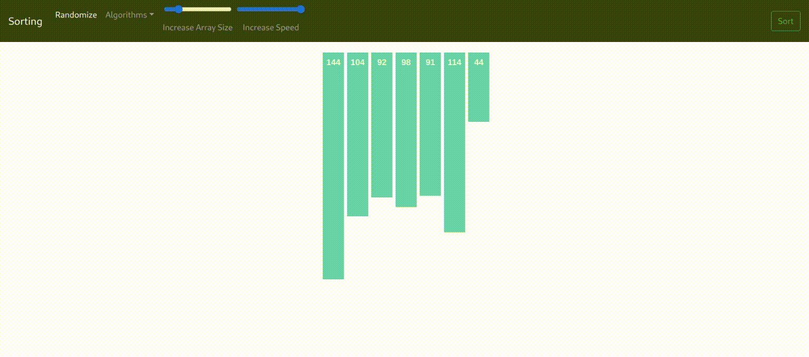

##   

Fascinated with DS and Algorithm?!! 
This website can be used to visualize multiple algorithms which includes Sorting, Pathfinding and ConvexHull. You can access it here:

## Algorithms

- ### Sorting

  - Selection Sort
  - Merge Sort
  - Quick Sort
    
  

- ### Pathfinding
  - Dijkstra's algorithm
    
    

- ### ConvexHull 
  - Graham's Scan
    
    

## Installation

- Install Node on your computer
- Clone this repository and the backend repository from <a href="https: .
- Open CMD on your computer and change the directory to the place where you cloned the front-end repository.
- Run the command **npm install** to install all the necessary packages from node server.
- Now run the command **npm start** to run the app on your localhost.
- Run the app live on **localhost:3000** 

Show some love ❤️ and Star ⭐️ the Repository to support the project.
